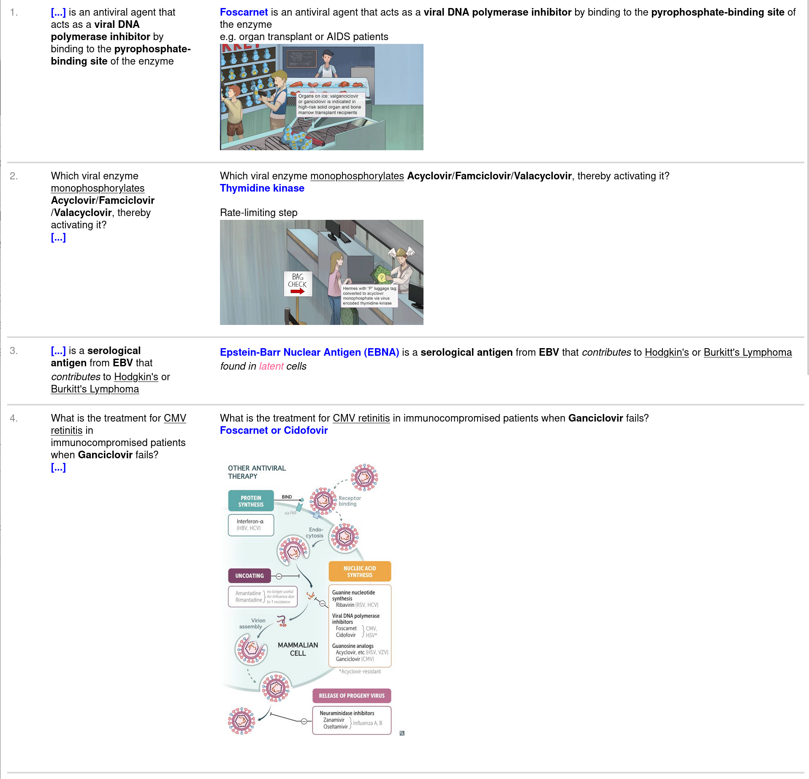
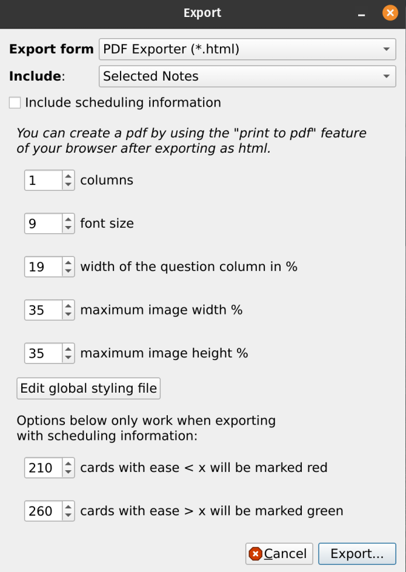

<b>This add-on was funded by the Anki Palace. Please consider supporting our work using the links below so we can continue to fund add-on projects like this.</b>
<b>This add-on was funded by the [AnKing Memberships](https://www.ankipalace.com/memberships). Please consider supporting us so we can continue to fund add-on projects like this.</b>

You must be on Anki > 2.1.36 to use this add-on

AnkiWeb listing: https://ankiweb.net/shared/info/1442112168

## How to Use
1. Create print templates
  In the "add card" or "edit card" dialog, choose the note type that will be printed. Click "Cards".  At the bottom, click the "PDF Exporter Templates" and you can see options for changing the exporter templates that will be printed. These templates are already premade for [AnKing Note Types](https://github.com/AnKingMed/AnKing-Note-Types). If the AnKing Note Type premade templates aren't working, you can use the menu AnKing->PDF Exporter->Reset AnKing Templates

<b>exporter templates video<b> 
https://user-images.githubusercontent.com/31575114/168179403-1ac03002-d13c-4316-884b-c9443e06e160.mp4

2. Export html file
   Export notes as normal, but change the dropdown from .apkg to .html and you will get the addon dialog. Watch the video for more
  
  <b>print to pdf video<b> 
https://user-images.githubusercontent.com/31575114/168179374-d80775c4-5e2c-4738-be72-397f411c878d.mp4

3. Open the .html file that is exported in any browser and you can then print from the browser

## Screenshots
<b>results<b> 

<b>export dialog<b> 

## Problems, Bugs, Errors, Improvements
If you find a serious bug, please submit it on <a href="https://github.com/ankipalace/" rel="nofollow">Github</a> or email us at ankingmed@gmail.com. Please remember that we are not coders and thus may not be able to provide support.

## Changelog:
   
2022-*****: Initial Release

### If you like these, please consider donating to this project

   
                      
   

 
<b>Check out our Anki Mastery Course! (The source of funding for this project)</b> 
          <a href="https://courses.ankipalace.com/?utm_source=anking_bg_add-on&amp;utm_medium=anki_add-on_page&amp;utm_campaign=mastery_course" rel="nofollow">https://courses.ankipalace.com</a>
<a href="https://courses.ankipalace.com/?utm_source=anking_bg_add-on&amp;utm_medium=anki_add-on_page&amp;utm_campaign=mastery_course" rel="nofollow">
   
  </a>

