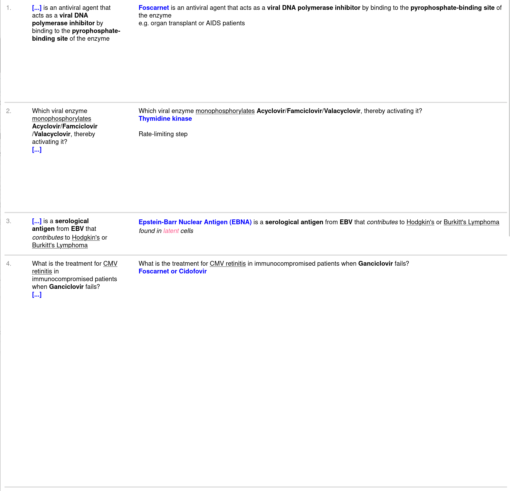

<b>This add-on was funded by the Anki Palace. Please consider supporting our work using the links below so we can continue to fund add-on projects like this.</b>
<b>This add-on was funded by the [AnKing Memberships](https://www.ankipalace.com/memberships). Please consider supporting us so we can continue to fund add-on projects like this.</b>

You must be on Anki > 2.1.36 to use this add-on

## How to Use
***

## Screenshots
<b>results<b> 

<b>export dialog<b> 

<b>print to pdf<b> 
https://user-images.githubusercontent.com/31575114/168179374-d80775c4-5e2c-4738-be72-397f411c878d.mp4

<b>exporter templates<b> 
https://user-images.githubusercontent.com/31575114/168179403-1ac03002-d13c-4316-884b-c9443e06e160.mp4

## Problems, Bugs, Errors, Improvements
If you find a serious bug, please submit it on <a href="https://github.com/ankipalace/" rel="nofollow">Github</a> or email us at ankingmed@gmail.com. Please remember that we are not coders and thus may not be able to provide support.

## Changelog:
   
2022-*****: Initial Release

### If you like these, please consider donating to this project

   
                      
   

 
<b>Check out our Anki Mastery Course! (The source of funding for this project)</b> 
          <a href="https://courses.ankipalace.com/?utm_source=anking_bg_add-on&amp;utm_medium=anki_add-on_page&amp;utm_campaign=mastery_course" rel="nofollow">https://courses.ankipalace.com</a>
<a href="https://courses.ankipalace.com/?utm_source=anking_bg_add-on&amp;utm_medium=anki_add-on_page&amp;utm_campaign=mastery_course" rel="nofollow">
   
  </a>

